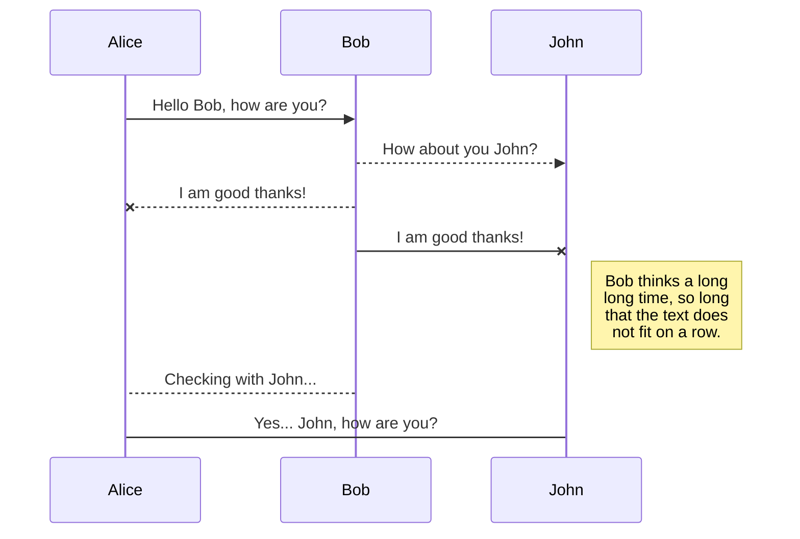
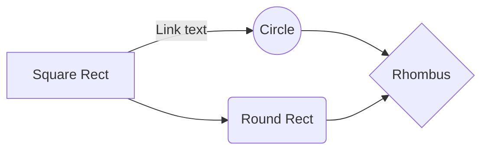

# CAPEv2 Sandbox Installation Part 1 - Up and Running with the Basics

So, I spent so much time using the official docs for CAPEv2. The Github readme and the install docs conflict a bit. There were also some very key issues called out in the Github issues section. Those are incorporated here. I installed and reinstalled over 40 times. Doomedraven has done a wonderful job of getting this code optimized and continuing on the Cuckoo project. Hopefully this documentation will save some time so that you can start utilizing this terrific project. Also, feel free to copy this documentation. It's for the community.

The official repositories for CAPEv2 and Doomedraven's Tools are below
[CAPEv2 Malware Configuration And Payload Extraction](https://github.com/kevoreilly/CAPEv2)
[@D00m3dr4v3n Tools](https://github.com/doomedraven/Tools)

# Hardware

Let's talk about hardware. I've run the install on a 2U Dell Server from 2021 with 2 CPUs, 16 cores, 128GB RAM, and 30TB of SSD RAID to a small micro PC from HP. This will work on almost anything that can run at least 1 Windows 10  VM. You'll probably want at least a 4 core processor (recent-ish), 16GB RAM, and 128GB SSD minimum. More is better obviously. Don't get too hung up on hardware. Let's get this thing running!

## Install Ubuntu 22.04 LTS Desktop Edition

 1. Download Ubuntu 22.04 LTS Desktop from the official repository
    [Ubuntu 22.04 LTS ISO](https://ubuntu.com/download/desktop)  
   
 2. Create a bootable USB installer for your newly downloaded ISO file. I
    recommend Balena Etcher as it works on Mac and Windows. [Download
    Balena Etcher](https://www.balena.io/etcher/). You'll need at least
    an 8GB USB drive for this task.
    
 3. Boot the PC/server that you've chosen for the CAPEv2 install with the newly created Ubuntu 22.04 LTS USB. 
 4. During the install, choose minimal install, uncheck download updates while installing (we will get to those later from the command line).
 5. Choose your disk formatting. I recommend a to use the entire disk and reinstall completely over any OS that was on that device before. 
 6. When it's time to choose a machine name and user, I'd recommend using *cape* as your username and whatever computer name you happen to choose. Login automatically works for me as the console of this machine is secure. This is purely a risk decision on your part.
 7. Choose your timezone. I set mine to UTC, but this again is a personal choice.
 8. Reboot this PC when instructed (remove the install media).
 9. Once the Ubuntu Desktop is up, you might get a welcome pop up. For Livepatch just click next. We don't need that running. Help Improve Ubuntu? Choose No, don't send system info and click next. Privacy screen, click next. Click Done. (At time of writing this was valid for 22.04.1 LTS).
 10. If/When Software Updater pops up, just close it. 
 11. From the Activities button find Settings. Open Power. Choose Performance, turn off dim screen, and change screen blank time to never (it's at the bottom of that dropdown list). Close settings.
 12. Click Activities and search for Terminal. Might want to drag that to your favorites bar as we will need it. 
 13. From the terminal issue the following commands
		

    sudo apt update && sudo apt upgrade -v && sudo reboot
    
    

 14. Log back into the Ubuntu device and open the Terminal in preparation for the dependencies installation.

 

 

## Getting some dependencies out of the way

This is where the instructions incorporate my experience. Would like to give a shout out to Victor Batiz for the assist on some of this. Always nice to have someone else to help from time to time. 

 1. Let get some packages installed. You can omit openssh-server and vim if you don't want those. I found that if I didn't do this, pyre2 would fail every time during the cape2.sh script that we execute later.
 `sudo apt-get install -y git build-essential cmake ninja-build python3-dev cython3 pybind11-dev python3-pip libre2-dev vim openssh-server acpica-tools `
 
 2. Once step 1 completes, let's get our KVM installer downloaded.
 3. `wget https://raw.githubusercontent.com/doomedraven/Tools/blob/master/Virtualization/kvm-qemu.sh`
 4. This file will need to be edited with some hardware information. I think this is right, but if it's not, please feel free to put in an issue and give us the assist. Documentation was not good regarding this, so hours upon hours where spent. Here's how I got the data I believe is correct to replace WOOT within the kvm-qemu script. Run the following commands. I recommend doing this from a temp folder you can create in your home directory. Once again, this is my estimation of what to do as the instructions literally say to Google it.
 5. `sudo acpidump > acpidump.out`
 6. `sudo acpixtract -a acpidump.out`
 7. `sudo iasl -d dsdt.dat`  (NOTE: my steps are case sensitive)
 8.  The output of that last command produced a line that contained a 4 digit code. ACPI: DSDT 0x0000000000000000 0213AC (v02 HPQOEM **82BF**     00000000 INTL 20121018). I used 82BF to replace all of the `<WOOT>` instances in the kvm-qemu.sh file.
 9. Execute the installer for KVM from the terminal `sudo ./kvm-qemu.sh all cape | tee kvm-qemu.log`
 10. Install virtmanager GUI `sudo ./kvm-qemu.sh virtmanager cape | tee kvm-qemu-virtmanager.log` 
 11. `sudo reboot`

## Install CAPEv2 Sandbox

In this section we install CAPEv2. The installer will need to be edited a little. Additionally, I had some problems with tor, so I disabled that in the config. Obviously, you'd probably want this functionality. Let's get it running and then we can enable extra features one at a time so troubleshooting is easier if there are any problems.

 1. Open the Terminal and let's get going. Go to your home directory `cd ~`
 2. `git clone https://github.com/kevoreilly/CAPEv2.git`
 3.  `cd CAPEv2/installer`
 4.  Edit cape2.sh with your favorite editor 
 5.  Here are some of the parameters. Verify these.

> NETWORK_IFACE=virbr0 
> IFACE_IP="192.168.122.1"
> PASSWD="typeyourpasswordhere"
> USER=cape

 6. `sudo chmod +x cape2.sh`
 7. `sudo ./cape2.sh base | tee cape.log`
 8. `sudo reboot`
 9. Once rebooted, there is one more hurdle. This one took me a while to figure out. It was buried in the issues section of the Github repository. The database doesn't have proper permissions by default, so this will correct that.
 10. From the Terminal `sudo -u postgres psql`
 11. `ALTER DATABASE cape OWNER TO cape;`
 12. `exit` 
 13. `cd /opt/CAPE`
 14.  Run `sudo journalctl -u cape.service`. This will show the log for the CAPE service. My first try showed that some dependencies were missing. Yours may vary, but this is what I had to do next.
 15. `poetry run pip3 install https://github.com/CAPESandbox/peepdf/archive/20eda78d7d77fc5b3b652ffc2d8a5b0af796e3dd.zip#egg=peepdf==0.4.2`
 16. `poetry run pip3 install -U git+https://github.com/DissectMalware/batch_deobfuscator`
 17. `poetry run pip3 install -U git+https://github.com/CAPESandbox/httpreplay`
 18. Work through that until you get no errors from journalctl. You might have to restart the service. The other cape services can be found by typing journalctl -u cape and hitting tab a couple of times. This will list out the other services. You'll need to look at these to figure out if anything is wrong.
## Build an Analysis VM

We will need a virtual machine build for analyzing malware samples. A Windows 7 VM will work. You can use Windows 7, Windows 10, Windows 11, Windows Server, Linux, etc. Let's start with one. Disabling the services on Windows 7 is a bit of a pain, but Doomedraven has a good script to automate the process. You'll need a Windows 7 license and I strongly suggest a copy of MS Office (2019 or 2016 is just fine). The new version might be too chatty on the network. Some people suggest 4GB of RAM for the VMs but I use 8GB. Also, never use less than 2 cores or CPUs. No devices in the past 10 years are single core and malware might look for that. Let's start.

 1. Install Windows 7x64. Do not be attached to the network while installing and after install. We do not want this VM to take updates.
 2. Download some software for the VM onto a USB drive. 
 

> Python3 32bit for Windows (imperative that this is 32bit) When you install Python make sure you install for all users and check the option to include Python in the PATH [Download](http://www.python.org/getit/)
> 
> Older versions of Adobe Acrobat. Try something from 2017 or so. I like to make sure the version I choose is one of the first of that major version. [Adobe Acrobat - Archive](ftp://ftp.adobe.com/pub/adobe/reader/win/)
> 
> Download Microsoft Office Installer
> 
> Get Doomedraven's script for disabling Windows 7 noise [Download script](https://raw.githubusercontent.com/doomedraven/Tools/master/Windows/disable_win7noise.bat)
> 
> Download Chocolately batch file for Windows [choco.bat](https://raw.githubusercontent.com/doomedraven/Tools/master/Windows/choco.bat)

 3. List item

## Export a file

You can export the current file by clicking **Export to disk** in the menu. You can choose to export the file as plain Markdown, as HTML using a Handlebars template or as a PDF.

# Synchronization

Synchronization is one of the biggest features of StackEdit. It enables you to synchronize any file in your workspace with other files stored in your **Google Drive**, your **Dropbox** and your **GitHub** accounts. This allows you to keep writing on other devices, collaborate with people you share the file with, integrate easily into your workflow... The synchronization mechanism takes place every minute in the background, downloading, merging, and uploading file modifications.

There are two types of synchronization and they can complement each other:

- The workspace synchronization will sync all your files, folders and settings automatically. This will allow you to fetch your workspace on any other device.
	> To start syncing your workspace, just sign in with Google in the menu.

- The file synchronization will keep one file of the workspace synced with one or multiple files in **Google Drive**, **Dropbox** or **GitHub**.
	> Before starting to sync files, you must link an account in the **Synchronize** sub-menu.

## Open a file

You can open a file from **Google Drive**, **Dropbox** or **GitHub** by opening the **Synchronize** sub-menu and clicking **Open from**. Once opened in the workspace, any modification in the file will be automatically synced.

## Save a file

You can save any file of the workspace to **Google Drive**, **Dropbox** or **GitHub** by opening the **Synchronize** sub-menu and clicking **Save on**. Even if a file in the workspace is already synced, you can save it to another location. StackEdit can sync one file with multiple locations and accounts.

## Synchronize a file

Once your file is linked to a synchronized location, StackEdit will periodically synchronize it by downloading/uploading any modification. A merge will be performed if necessary and conflicts will be resolved.

If you just have modified your file and you want to force syncing, click the **Synchronize now** button in the navigation bar.

> **Note:** The **Synchronize now** button is disabled if you have no file to synchronize.

## Manage file synchronization

Since one file can be synced with multiple locations, you can list and manage synchronized locations by clicking **File synchronization** in the **Synchronize** sub-menu. This allows you to list and remove synchronized locations that are linked to your file.

# Publication

Publishing in StackEdit makes it simple for you to publish online your files. Once you're happy with a file, you can publish it to different hosting platforms like **Blogger**, **Dropbox**, **Gist**, **GitHub**, **Google Drive**, **WordPress** and **Zendesk**. With [Handlebars templates](http://handlebarsjs.com/), you have full control over what you export.

> Before starting to publish, you must link an account in the **Publish** sub-menu.

## Publish a File

You can publish your file by opening the **Publish** sub-menu and by clicking **Publish to**. For some locations, you can choose between the following formats:

- Markdown: publish the Markdown text on a website that can interpret it (**GitHub** for instance),
- HTML: publish the file converted to HTML via a Handlebars template (on a blog for example).

## Update a publication

After publishing, StackEdit keeps your file linked to that publication which makes it easy for you to re-publish it. Once you have modified your file and you want to update your publication, click on the **Publish now** button in the navigation bar.

> **Note:** The **Publish now** button is disabled if your file has not been published yet.

## Manage file publication

Since one file can be published to multiple locations, you can list and manage publish locations by clicking **File publication** in the **Publish** sub-menu. This allows you to list and remove publication locations that are linked to your file.

# Markdown extensions

StackEdit extends the standard Markdown syntax by adding extra **Markdown extensions**, providing you with some nice features.

> **ProTip:** You can disable any **Markdown extension** in the **File properties** dialog.

## SmartyPants

SmartyPants converts ASCII punctuation characters into "smart" typographic punctuation HTML entities. For example:

|                |ASCII                          |HTML                         |
|----------------|-------------------------------|-----------------------------|
|Single backticks|`'Isn't this fun?'`            |'Isn't this fun?'            |
|Quotes          |`"Isn't this fun?"`            |"Isn't this fun?"            |
|Dashes          |`-- is en-dash, --- is em-dash`|-- is en-dash, --- is em-dash|

## KaTeX

You can render LaTeX mathematical expressions using [KaTeX](https://khan.github.io/KaTeX/):

The *Gamma function* satisfying $\Gamma(n) = (n-1)!\quad\forall n\in\mathbb N$ is via the Euler integral

$$
\Gamma(z) = \int_0^\infty t^{z-1}e^{-t}dt\,.
$$

> You can find more information about **LaTeX** mathematical expressions [here](http://meta.math.stackexchange.com/questions/5020/mathjax-basic-tutorial-and-quick-reference).

## UML diagrams

You can render UML diagrams using [Mermaid](https://mermaidjs.github.io/). For example, this will produce a sequence diagram:

And this will produce a flow chart:

